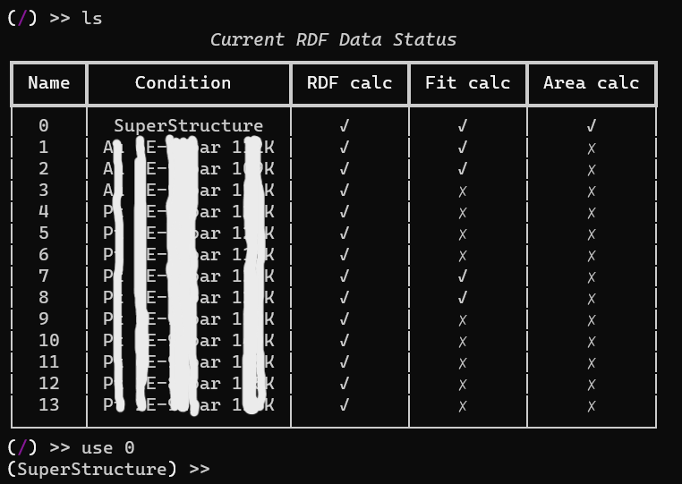
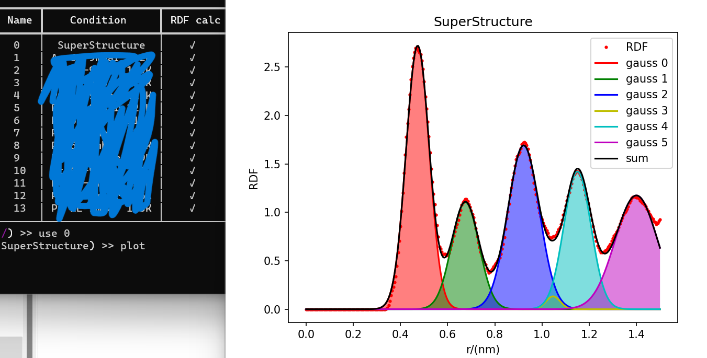
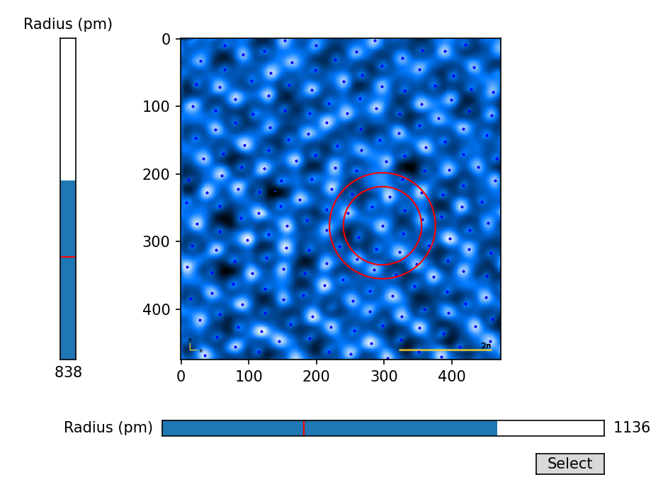

# Radial distribution function


 





### The code

The Core code is in rdf_core.py

The polt.py and plotting.py is used to plot the figure.

The interactive.py gives you a chance to see what caused a rdf figure. (radius based)

The rdf.py is the main entrance for the program.

Here is the common commands:

- ls -- list all datas
- rdf -- calc the rdf 
- plot -- plot a certain line
- use {index} -- enter the operation mode of the certain data folder

### The Usage

All data should be organized in a format of `labelme` (json), a python label tool, and only point mode is used in this program.

All data should be place in different folders under a `data` folder, and the data folder and the root folder should be defined in the config.json file.

In each data folder,  a `struct.txt` is expected. This file has two columns, the first is the json file name in this folder, and the second column is the real size of the height of the picture.

### Example

For example, you have some pictures and you want to get the averaged rdf of them.

1. You install labelme by `pip install labelme`, and them open it by input labelme in the terminal.

2. You label a picture by labelme using the 'add a point' mode.

3. If this picture in real space is 5mm\*6mm (width\*height), and in pixel is 250\*300, just create a `struct.txt` file in this folder, and input:

   > ```
   > {pic_name1}.json 6
   > {pic_name2}.json 4.5
   > {pic_name3}.json 8
   > ......
   > ```

4. Don't forget to config the `config.json`, and remember, the program will not make new dirs, you should do this by yourself.
5. start the rdf.py, and input `ls`, because of the config and the struct.txt, the all data should list on the screen.

### Dependency

- rich
- numpy
- scipy
- matplotlib

